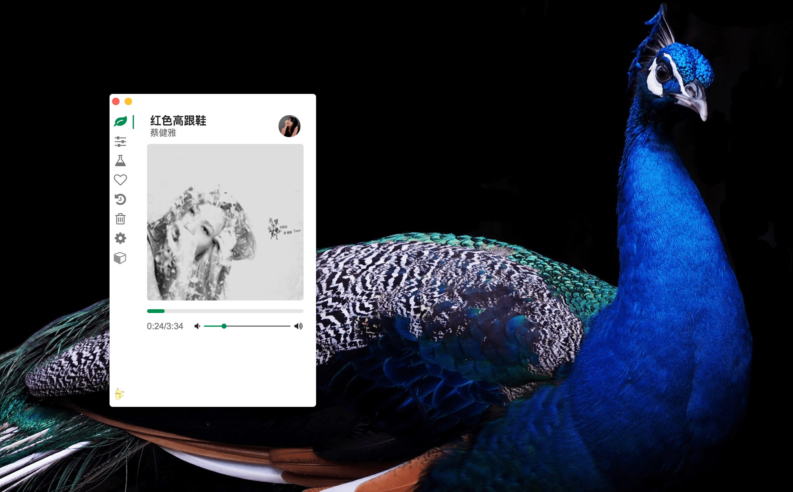

# Petal 

[](https://travis-ci.org/ilime/Petal)  [](https://opensource.org/licenses/MIT)

:hibiscus: [Douban.FM](https://douban.fm) Client With Extra - - -

# Screenshot



# Use it

Go to [release page](https://github.com/ilime/Petal/releases)

# How to develop

```
git clone git@github.com:ilime/Petal.git && cd Petal/
npm install && npm run bundle:dev+main && npm run dev:hot
// Open a new terminal
npm start
```
# How to build

```
chmod +x build.sh
./build.sh
```

# How to contribute

Pull a request and open a issue to describe your changes

> Note: view .eslintrc.json, .editorConfig and follow the code style

# License

MIT &copy; [ilime](https://github.com/ilime)
